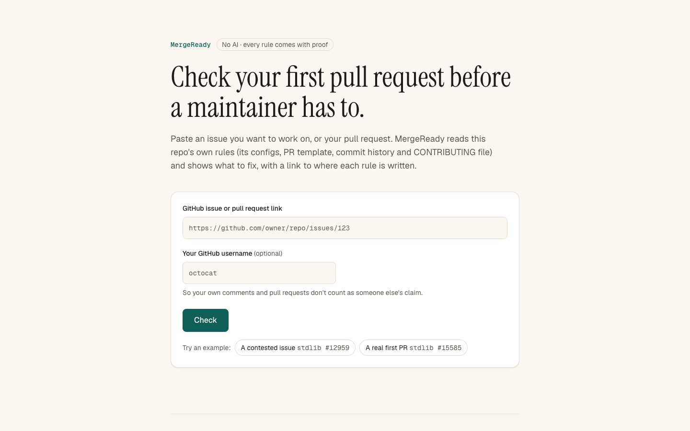
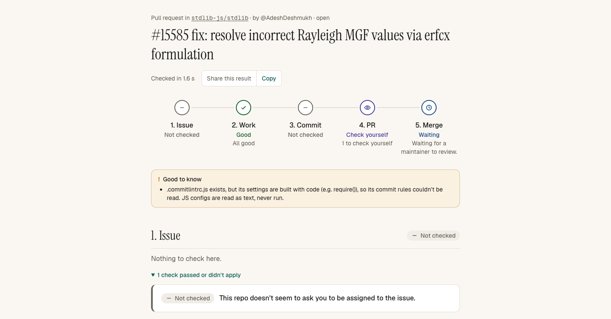

# MergeReady

**Check your first pull request before a maintainer has to.**

Live: https://mergeready-three.vercel.app

Paste a link to a GitHub issue or pull request. MergeReady reads that repository's own contribution rules and tells a first-time contributor what could block their first PR, before they start work and before they ask for review. Every rule comes with proof: the exact sentence, config file or commit history it was taken from.





Built solo for the [FirstCommit hackathon](https://firstcommit.devpost.com) (25 to 30 September 2026).

## The problem

New contributors often get their first pull request sent back for reasons that have nothing to do with their code: a missing sign-off, an unticked checklist, a commit message in the wrong format, or an issue someone else was already working on.

A real example: on [stdlib-js/stdlib#12959](https://github.com/stdlib-js/stdlib/issues/12959), a "Good First Issue", two newcomers each said they wanted to work on it and each opened their own pull request. Nobody was assigned. At most one of those PRs can be merged.

Big projects use bots to catch these problems, but bots speak up only after a PR is public. MergeReady works before that, on any public repository.

## What it does

**Issue link: before you start work**
- Is the issue already assigned, or claimed in the comments?
- Are there already open pull requests for it?
- Is the repository archived or inactive?
- Does this repo ask you to be assigned first?

**Pull request link: before you ask for review**
- Commit or PR-title format (for example Conventional Commits)
- DCO sign-off on every commit
- PR template: required sections filled, required checkboxes ticked
- Linked issue (and a warning if `Fixes #123` won't work because the PR doesn't target the default branch)
- Issue assigned to you, if the repo asks for it
- Tests changed when code changed

Results appear as a journey map (Issue, Work, Commit, PR, Merge). Each check explains the problem in plain English, gives fix steps with copyable commands, and shows its evidence. MergeReady also drafts a PR description that follows the repo's template, but it never ticks checkboxes for you: only you can make those promises.

## How it works

There is no AI inside MergeReady. Rules are extracted with deterministic TypeScript, so the same input always gives the same result, and every rule can be traced to its source.

Rules come from four sources, strongest first:

| Source | Example | Shown as |
|---|---|---|
| Config files | commitlint config, .github/dco.yml, GitHub workflows | Repo config |
| PR template | headings, checkboxes, `Fixes #` fields | PR template |
| Commit history | "41 of the last 41 commits (not counting merges and bots) follow Conventional Commits" | Commit history |
| Contributing docs | "Your commit must contain the Signed-off-by line" | CONTRIBUTING text |

Commit history matters because some rules are never written in a readable form: stdlib builds its commitlint config with code we won't execute, and many CNCF projects run the DCO app without any config file.

A failed rule is red only when the source clearly requires it (a config file, or words like "must" and "required"). Otherwise it is yellow. Issue checks don't need a rule: an issue that is closed or assigned to someone else, or an archived repo, is always red. For pull request checks, no rule found means the check is skipped, never failed.

```
URL -> GitHub API (guidelines, linked docs, configs, recent commits, issue/PR)
    -> extractRules (config + template + history + prose)
    -> runChecks -> journey map, check cards, PR description
```

## Does it work? (evaluation)

I measured MergeReady against what maintainers actually objected to in first-time contributors' pull requests from stdlib-js/stdlib, nodejs/node, prometheus/prometheus and vitejs/vite. Selection rules were committed before running the tool, each PR was rebuilt as it was when first submitted, and labels were locked before scoring.

| Run | Recall | Precision |
|---|---|---|
| First version, 80 PRs | 9/18 (50%) | 9/90 (10%) |
| After fixing bugs found by that run, same 80 PRs (optimistic) | 9/18 (50%) | 9/31 (29%) |
| **Held-out: 19 new PRs (main result)** | **3/5** | **3/7** |

On the held-out set, both red flags were wrong (0/2); the 3 correct flags were yellow. The first run exposed too many false alarms, mostly from template and doc text that wasn't a real requirement: examples, HTML comments and "If it applies" lines gave 47 linked-issue flags, and Prometheus's "ALL commits must be considered" made its release-notes section look required (14 flags). I fixed the rules in a general way, froze the tool, and tested on PRs it had never seen. The sample is small, so uncertainty is large (95% intervals in the report).

Labels: I labeled the first 4 PRs myself. For the rest, Claude (chat) drafted labels from neutral summaries using written criteria, and I reviewed and approved them.

Full method, deviations and limitations: [eval/REPORT.md](eval/REPORT.md)

## Built with

- Next.js 16 (App Router), React 19, TypeScript, Tailwind CSS 4
- Octokit for the GitHub REST and GraphQL APIs
- `yaml` to read YAML configs safely (config files are parsed, never executed)
- `react-markdown` + `remark-gfm` to show contributing sections safely (raw HTML is not rendered)
- Vitest (430 tests)
- Deployed on Vercel

## Run it locally

Requires Node.js 22 or newer and a GitHub **classic** personal access token with **no scopes** (it only reads public data). Fine-grained tokens hide some timeline events, so MergeReady would miss PRs that mention an issue.

```bash
git clone https://github.com/singhakousik363-del/mergeready.git
cd mergeready
npm install
cp .env.example .env.local   # then put your token after GITHUB_TOKEN=
npm run dev
```

Open http://localhost:3000.

```bash
npm test
npm run lint
npm run build
node --env-file=.env.local --import tsx scripts/try-rules.ts stdlib-js/stdlib
node --env-file=.env.local --import tsx scripts/try-checks.ts https://github.com/stdlib-js/stdlib/issues/12959
```

## Project structure

```
app/          page, API route (/api/analyze), UI components
lib/github/   guidelines, linked docs, configs, commits, issues, PRs
lib/rules/    rule extraction from config, template, history, prose
lib/checks/   checks, journey map, PR description
lib/server/   input validation, cache, rate limit, time budget
lib/ui/       UI labels, share links, markdown links
eval/         evaluation scripts, data, REPORT.md
scripts/      try each part on real repositories
```

## Known limitations

- English only; rules in unusual wording can be missed.
- Linked docs are followed one level deep. Rules on external websites (like React's) can't be read, and the UI says so.
- Commit format checks look at the message's shape, not line length or subsystem names.
- Without a .github/dco.yml file, the DCO GitHub App is only visible through commit history.
- Cache and rate limit are per server instance on Vercel.

The full list is in [CLAUDE.md](CLAUDE.md).

## AI usage (disclosure)

MergeReady itself uses no AI, but I built it with a lot of AI help.

- **Claude Code** wrote most of the code and tests, following plans I reviewed and approved step by step.
- **Claude (chat)** helped me brainstorm and check ideas, planned the build, wrote the first version of `lib/github/parseUrl.ts`, drafted evaluation labels (which I approved), and drafted this README and my DEVLOG from our conversation, which I reviewed and approved.
- **My part:** choosing the idea after checking that similar tools already existed; the design decisions (no AI in the product, every rule with a quote and link, learning rules from commit history, never ticking checkboxes for users, yellow instead of red when evidence is weak); insisting on testing on real repositories; and pre-registering a held-out evaluation.

Every step is logged in [AI_LOG.md](AI_LOG.md). Most commits made with Claude Code are marked `Co-Authored-By`; the first 3 commits on 25 Sep were not.

## What I learned

- **Passing tests is not the same as working.** 104 mocked tests passed, but on real data my token type was silently hiding the very PRs the tool exists to find.
- **Real data beats assumptions.** React's CONTRIBUTING.md is one link, Node's links to 9 other documents, and GitHub's `author_association` doesn't reliably mark first-time contributors.
- **Measure yourself honestly.** My first evaluation scored 10% precision. Finding out why and re-testing on unseen data taught me more than any feature.
- **Check before you build.** Several ideas I liked already existed; searching first saved days.
- **Directing AI is a skill.** Good results came from asking for plans first, questioning every result, and rejecting changes I didn't understand.

## Credits

- GitHub REST and GraphQL APIs for all repository, issue and PR data.
- Test fixtures and evaluation data (eval/data/) from public open-source repositories; fixture sources and licenses are listed in lib/rules/\_\_fixtures\_\_/SOURCES.md and lib/checks/\_\_fixtures\_\_/SOURCES.md.
- Fonts: Geist, Geist Mono and Instrument Serif, via next/font.
- Libraries: Next.js, React, Tailwind CSS, Octokit, yaml, react-markdown, remark-gfm, Vitest, tsx.

## License

MIT, see [LICENSE](LICENSE).

## Author

Kousik Singha, first-year B.Tech CSE student.
